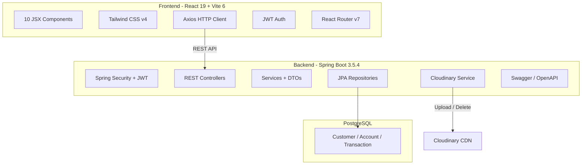

# 💰 CashCanvas

> A **secure, full-stack digital banking platform** built with **Spring Boot** and **React** — featuring JWT authentication, role-based access, fund transfers, and real-time account management.

[](https://adoptium.net/)
[](https://spring.io/projects/spring-boot)
[](https://react.dev/)
[](https://vite.dev/)
[](https://tailwindcss.com/)
[](https://www.postgresql.org/)
[](LICENSE)

---

## 📸 Screenshots

> _Coming soon — add screenshots of the dashboard, login page, and transaction views here._

---

## ✨ Features

### � Authentication & Security
- JWT-based login & registration
- Role-based access control (`USER` / `ADMIN`)
- Spring Security integration
- Secure token storage via `sessionStorage`

### 💳 Account Management
- Create & manage multiple account types
- View balances and account details
- Profile photo upload via **Cloudinary**

### 💸 Transactions
- Fund transfers with balance validation
- Complete transaction history
- Automatic rollback on failure

### 🛡️ Admin Panel
- View all customers, accounts & transactions
- Centralized admin dashboard

### 🎨 Modern Frontend
- Responsive design (mobile, tablet, desktop)
- Dark mode support
- Smooth navigation with React Router
- Interactive tooltips and icon library

---

## �️ Architecture



---

## 🛠️ Tech Stack

| Layer    | Technology                  | Version |
|----------|-----------------------------|---------|
| Backend  | Spring Boot                 | 3.5.4   |
| Backend  | Java                        | 17      |
| Backend  | Spring Security             | managed |
| Backend  | JWT (jjwt)                  | 0.11.5  |
| Backend  | PostgreSQL                  | 15+     |
| Backend  | Lombok                      | 1.18.42 |
| Backend  | Cloudinary                  | 2.3.0   |
| Backend  | SpringDoc OpenAPI (Swagger) | 2.8.5   |
| Frontend | React                       | 19.0    |
| Frontend | Vite                        | 6.1     |
| Frontend | Tailwind CSS                | 4.0.3   |
| Frontend | React Router                | 7.1.5   |
| Frontend | Axios                       | 1.7.9   |
| Frontend | jwt-decode                  | 4.0.0   |

---

## 🚀 Getting Started

### Prerequisites

| Tool         | Version | Download |
|--------------|---------|----------|
| Java JDK     | 17+     | [Adoptium](https://adoptium.net/) |
| Node.js      | 18+     | [nodejs.org](https://nodejs.org/) |
| PostgreSQL   | 15+     | [postgresql.org](https://www.postgresql.org/download/) |
| Maven        | 3.9+    | _or use the bundled `mvnw` wrapper_ |

### 1. Clone the Repository

```bash
git clone https://github.com/anupam9919/CashCanvas.git
cd CashCanvas
```

### 2. Database Setup

```sql
CREATE DATABASE bankingapp;
CREATE USER bankinguser WITH PASSWORD 'your_password';
GRANT ALL PRIVILEGES ON DATABASE bankingapp TO bankinguser;
```

### 3. Backend Configuration

Create `Backend/src/main/resources/application.properties`:

```properties
server.port=8080

# PostgreSQL
spring.datasource.url=jdbc:postgresql://localhost:5432/bankingapp
spring.datasource.username=bankinguser
spring.datasource.password=your_password
spring.datasource.driver-class-name=org.postgresql.Driver

# JPA
spring.jpa.hibernate.ddl-auto=update
spring.jpa.show-sql=true

# JWT
jwt.secret=YourSuperSecretKeyAtLeast32CharsLong!!

# Cloudinary
cloudinary.cloud_name=YOUR_CLOUD_NAME
cloudinary.api_key=YOUR_API_KEY
cloudinary.api_secret=YOUR_API_SECRET
```

> ⚠️ **Do not commit** this file — it's already in `.gitignore`.

### 4. Run the Backend

```bash
cd Backend
./mvnw spring-boot:run      # Linux/Mac
.\mvnw.cmd spring-boot:run   # Windows
```

Backend starts at → **http://localhost:8080**

### 5. Run the Frontend

```bash
cd Frontend
npm install
npm run dev
```

Frontend starts at → **http://localhost:5173**

---

## � API Overview

| Method | Endpoint               | Access | Description            |
|--------|------------------------|--------|------------------------|
| POST   | `/public/register`     | Public | Register new user      |
| POST   | `/public/login`        | Public | Login & get JWT        |
| GET    | `/customer/profile`    | User   | View profile           |
| PUT    | `/customer/profile`    | User   | Update profile         |
| GET    | `/account/all`         | User   | List user accounts     |
| POST   | `/account/create`      | User   | Create new account     |
| POST   | `/transaction/transfer`| User   | Fund transfer          |
| GET    | `/transaction/history` | User   | Transaction history    |
| GET    | `/admin/customers`     | Admin  | List all customers     |
| GET    | `/admin/accounts`      | Admin  | List all accounts      |

> 📖 Full interactive docs at **http://localhost:8080/swagger-ui.html**

---

## � Project Structure

```
CashCanvas/
├── Backend/
│   └── src/main/java/com/ak/BankingApp/
│       ├── config/          # Security, CORS, OpenAPI, Cloudinary
│       ├── controller/      # REST controllers (5)
│       ├── dto/             # Data Transfer Objects
│       ├── mapper/          # Entity ↔ DTO mappers
│       ├── model/           # JPA entities
│       ├── repository/      # Spring Data JPA repos
│       └── service/         # Business logic
├── Frontend/
│   └── src/
│       ├── components/      # React components (10)
│       ├── AuthContext.jsx   # Auth state management
│       └── BackendUrlConfig.js
└── README.md
```

---

## �️ Roadmap

- [ ] 📊 Analytics dashboard
- [ ] 📩 Real-time notifications (WebSocket)
- [ ] 🔑 Multi-factor authentication
- [ ] 💱 Multi-currency support
- [ ] 📱 Progressive Web App (PWA)
- [ ] 🧪 Unit & integration tests

---

## 🤝 Contributing

Contributions are welcome! Feel free to open issues or submit pull requests.

1. Fork the repository
2. Create a feature branch (`git checkout -b feature/amazing-feature`)
3. Commit your changes (`git commit -m 'Add amazing feature'`)
4. Push to the branch (`git push origin feature/amazing-feature`)
5. Open a Pull Request

---

## 📄 License

This project is licensed under the **MIT License** — see the [LICENSE](LICENSE) file for details.

---

<p align="center">
  Made with ❤️ by <strong>Anupam Singh</strong>
</p>
