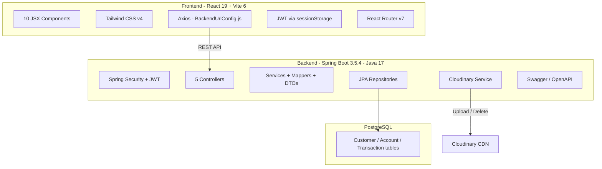

# 💰 CashCanvas — Setup & Installation Guide

A full-stack banking application (**CashCanvas**) with a **Spring Boot 3.5.4** backend and a **React 19 + Vite 6** frontend.

---

## Codebase DNA Summary



| Layer    | Technology                 | Version  |
|----------|----------------------------|----------|
| Backend  | Spring Boot                | 3.5.4    |
| Backend  | Java                       | 17       |
| Backend  | Spring Security            | managed  |
| Backend  | JWT (jjwt)                 | 0.11.5   |
| Backend  | PostgreSQL Driver          | runtime  |
| Backend  | Lombok                     | 1.18.42  |
| Backend  | Spring Validation          | managed  |
| Backend  | Cloudinary                 | 2.3.0    |
| Backend  | SpringDoc OpenAPI (Swagger)| 2.8.5    |
| Frontend | React                      | 19.0     |
| Frontend | Vite                       | 6.1      |
| Frontend | Tailwind CSS               | 4.0.3    |
| Frontend | React Router               | 7.1.5    |
| Frontend | Axios                      | 1.7.9    |
| Frontend | jwt-decode                 | 4.0.0    |
| Frontend | react-icons                | 5.4.0    |
| Frontend | react-tooltip              | 5.28.0   |

---

## Prerequisites

Install these on your machine **before** proceeding:

| Tool          | Min. Version | Check command          | Download |
|---------------|-------------|------------------------|----------|
| **Java JDK**  | 17          | `java -version`        | [Adoptium](https://adoptium.net/) or [Oracle](https://www.oracle.com/java/technologies/downloads/) |
| **Maven**     | 3.9+ *(or use bundled wrapper)* | `mvn -v` | [maven.apache.org](https://maven.apache.org/download.cgi) |
| **Node.js**   | 18+         | `node -v`              | [nodejs.org](https://nodejs.org/) |
| **npm**       | 9+          | `npm -v`               | *(bundled with Node.js)* |
| **PostgreSQL**| 15+         | `psql --version`       | [postgresql.org](https://www.postgresql.org/download/) |

> [!IMPORTANT]
> A **Cloudinary** account is required for the profile-image upload feature. Sign up free at [cloudinary.com](https://cloudinary.com/).

---

## Step 1 — PostgreSQL Database Setup

Open a **psql** shell or **pgAdmin** and run:

```sql
CREATE DATABASE bankingapp;
-- If you want a dedicated user (recommended):
CREATE USER bankinguser WITH PASSWORD 'your_password';
GRANT ALL PRIVILEGES ON DATABASE bankingapp TO bankinguser;
```

> [!TIP]
> You can use the default `postgres` superuser during development if you prefer.

---

## Step 2 — Backend Configuration

The file `Backend/src/main/resources/application.properties` is **gitignored** — you must create it manually.

### Create `application.properties`

```
Backend/src/main/resources/application.properties
```

Paste the template below and fill in your values:

```properties
# ── Server ──
server.port=8080

# ── PostgreSQL ──
spring.datasource.url=jdbc:postgresql://localhost:5432/bankingapp
spring.datasource.username=bankinguser
spring.datasource.password=your_password
spring.datasource.driver-class-name=org.postgresql.Driver

# ── JPA / Hibernate ──
spring.jpa.hibernate.ddl-auto=update
spring.jpa.show-sql=true
spring.jpa.properties.hibernate.dialect=org.hibernate.dialect.PostgreSQLDialect

# ── JWT ──
jwt.secret=YourSuperSecretKeyAtLeast32CharsLong!!

# ── Cloudinary ──
cloudinary.cloud_name=YOUR_CLOUD_NAME
cloudinary.api_key=YOUR_API_KEY
cloudinary.api_secret=YOUR_API_SECRET
cloudinary.upload_folder=banking-app

# ── File Upload Limits (optional) ──
spring.servlet.multipart.max-file-size=5MB
spring.servlet.multipart.max-request-size=5MB
```

> [!CAUTION]
> **Never commit** this file to Git. It contains database credentials and API secrets. It's already listed in [.gitignore](.gitignore).

---

## Step 3 — Build & Run the Backend

```powershell
# From the repository root
cd Backend

# Using the bundled Maven wrapper (no Maven install needed):
.\mvnw.cmd spring-boot:run

# ── OR with globally installed Maven ──
mvn spring-boot:run
```

The backend will start on **http://localhost:8080**.  
Swagger UI will be available at **http://localhost:8080/swagger-ui.html**.

---

## Step 4 — Frontend Configuration

The frontend currently points to a **remote Render deployment**. Update it to your local backend:

### Edit [BackendUrlConfig.js](Frontend/src/BackendUrlConfig.js)

```diff
 const backendUrl = axios.create({
-    baseURL: 'https://bankingapp-jpot.onrender.com/',
+    baseURL: 'http://localhost:8080/',
 })
```

> [!NOTE]
> The backend CORS config in [SecurityConfig.java](Backend/src/main/java/com/ak/BankingApp/config/SecurityConfig.java) already allows `http://localhost:5173`, so no CORS changes are needed.

---

## Step 5 — Install & Run the Frontend

```powershell
# From the repository root
cd Frontend

# Install dependencies
npm install

# Start dev server
npm run dev
```

The frontend will start on **http://localhost:5173**.

---

## Quick Reference — Running Both Together

| Service  | Directory | Command            | URL                    |
|----------|-----------|--------------------|------------------------|
| Backend  | `Backend` | `.\mvnw.cmd spring-boot:run` | http://localhost:8080 |
| Frontend | `Frontend`| `npm run dev`       | http://localhost:5173  |

> [!TIP]
> Open **two** terminal windows — one for each service. Start the backend first so the frontend can connect to it.

---

## Verification Checklist

| # | Check | How |
|---|-------|-----|
| 1 | Backend starts without errors | No stack trace in console; see `Started BankingAppApplication` log |
| 2 | Swagger UI loads | Visit http://localhost:8080/swagger-ui.html |
| 3 | Frontend compiles | `npm run dev` shows `VITE vX.X.X ready` with local URL |
| 4 | Frontend connects to backend | Open http://localhost:5173 → Register → Sign In → see dashboard |
| 5 | Database tables created | Check pgAdmin or `psql -d bankingapp -c "\dt"` for customer, account, transaction tables |

---

## Troubleshooting

| Problem | Fix |
|---------|-----|
| `JAVA_HOME` not set | Set environment variable: `$env:JAVA_HOME = "C:\Program Files\Java\jdk-17"` (adjust path) |
| Port 8080 in use | Add `server.port=8081` in `application.properties` and update [BackendUrlConfig.js](Frontend/src/BackendUrlConfig.js) |
| PostgreSQL connection refused | Ensure PostgreSQL service is running: `Get-Service postgresql*` |
| Cloudinary errors on startup | Double-check your `cloudinary.*` values in `application.properties` |
| CORS errors in browser | Ensure backend CORS `allowedOrigins` matches your frontend's URL exactly |
